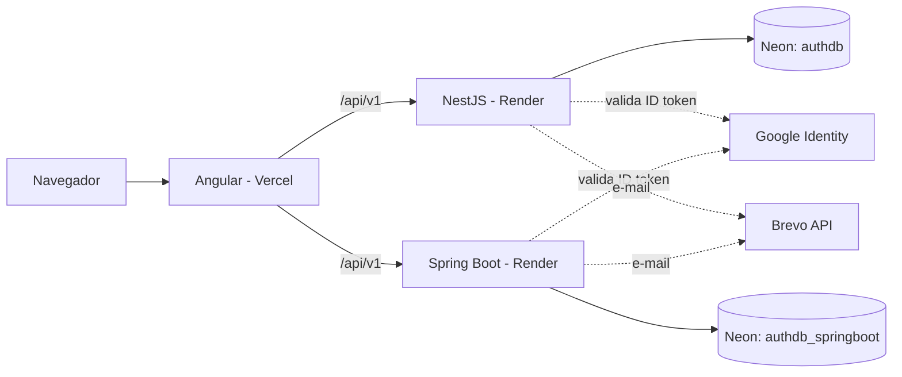

# 🔐 Auth Benchmark — Autenticação Full-Stack em múltiplas stacks

Sistema de autenticação e gestão de usuários de ponta a ponta, construído **duas vezes com o mesmo contrato de API** (NestJS e Spring Boot) e consumido por **um único front-end Angular** que alterna entre os backends. O objetivo é comparar tecnologias (praticidade, segurança, comportamento) sem alterar a lógica do cliente.

> 🧪 **Teste ao vivo:** https://auth-benchmark.vercel.app/

## 🚀 Teste em 1 minuto

1. Abra o link acima e escolha uma stack (**NestJS** ou **Spring Boot**).
2. Crie uma conta, entre com o **Google**, ative o **2FA** ou teste a **recuperação de senha** (o e-mail é real).
3. Para ver o painel administrativo, use a conta de demonstração:

| Campo  | Valor                     |
| ------ | ------------------------- |
| E-mail | `admin@authbenchmark.com` |
| Senha  | `uma-senha-forte-aqui`    |

> ⏳ **Primeira visita:** os servidores usam hospedagem gratuita e "dormem" após 15 minutos sem uso. O primeiro acesso a cada API pode levar **até 1 minuto**. Um aviso na tela mostra quando cada servidor acordar.
>
> 📬 O e-mail de recuperação de senha pode cair na **caixa de spam** (o remetente é um Gmail enviado por serviço terceiro).
>
> A conta de demonstração é fictícia e descartável. O dashboard permite excluir usuários comuns, então os dados deste ambiente são de teste.

## ✨ Funcionalidades

- **Cadastro e login** com e-mail e senha, emitindo JWT.
- **Refresh token com rotação:** cada refresh token é de uso único (guardado como hash no banco) e é trocado por um novo a cada renovação.
- **Login social com Google** (OAuth2 / Google Identity Services), com validação do ID token no backend.
- **2FA com TOTP** (Google Authenticator, Authy): configuração por QR Code, desafio no login e **proteção contra reuso do mesmo código**.
- **Recuperação de senha** com link de uso único, expira em 15 minutos, e-mail real via API.
- **RBAC** (`USER` e `ADMIN`): o admin lista usuários com paginação e exclui contas comuns. Admin não pode excluir a si mesmo nem outros admins.
- **Troca de backend em tempo de execução:** cada stack tem seu próprio shell visual e sua própria API, sem mudar os componentes.
- **Painel administrativo responsivo:** tabela no desktop e lista de cards no celular.

## 🧱 Arquitetura



| Camada     | Tecnologia                                                                      |
| ---------- | ------------------------------------------------------------------------------- |
| Front-end  | Angular 21 (standalone components, signals, zoneless), PrimeNG, Tailwind CSS v4 |
| Back-end 1 | Node.js 24, NestJS 11, TypeScript, Prisma 7, Passport/JWT                       |
| Back-end 2 | Java 21, Spring Boot 4, Spring Security, JPA/Hibernate, Flyway, Bucket4j        |
| Banco      | PostgreSQL (Neon), um banco por API no mesmo servidor                           |
| E-mail     | Brevo (API HTTP)                                                                |
| Hospedagem | Vercel (front), Render com Docker (APIs), Neon (banco)                          |
| Back-end 3 | **Laravel: planejado, ainda não implementado**                                  |

### Estrutura do repositório

```
auth-benchmark/
├── frontend-angular/                       # Cliente único
├── backend-nestjs/                         # API NestJS
└── backend-springboot/backend-springboot/  # API Spring Boot
```

## 🔌 Contrato da API (idêntico nas duas stacks)

Base: `/api/v1`

| Acesso  | Método   | Rota                    | Descrição                                                         |
| ------- | -------- | ----------------------- | ----------------------------------------------------------------- |
| Público | `POST`   | `/auth/register`        | Cria conta                                                        |
| Público | `POST`   | `/auth/login`           | Retorna JWT ou pede 2FA                                           |
| Público | `POST`   | `/auth/2fa/verify`      | Token temporário + código de 6 dígitos                            |
| Público | `POST`   | `/auth/social/google`   | Valida o token do Google e emite o JWT                            |
| Público | `POST`   | `/auth/forgot-password` | Solicita recuperação (resposta genérica)                          |
| Público | `POST`   | `/auth/reset-password`  | Redefine a senha com o token                                      |
| Público | `POST`   | `/auth/refresh`         | Renova o acesso trocando o refresh token (uso único, com rotação) |
| Público | `POST`   | `/auth/logout`          | Invalida o refresh token no servidor                              |
| Usuário | `GET`    | `/user/profile`         | Perfil autenticado                                                |
| Usuário | `POST`   | `/user/2fa/setup`       | Gera QR Code e secret TOTP                                        |
| Usuário | `POST`   | `/user/2fa/enable`      | Confirma o primeiro código e ativa o 2FA                          |
| Admin   | `GET`    | `/admin/users`          | Lista usuários (paginada)                                         |
| Admin   | `DELETE` | `/admin/users/{id}`     | Exclui usuário comum                                              |

## 🛡️ Segurança

| Proteção               | Como é tratada                                                                                                                                                                                                                                         |
| ---------------------- | ------------------------------------------------------------------------------------------------------------------------------------------------------------------------------------------------------------------------------------------------------ |
| SQL Injection          | Acesso a dados somente via ORM (Prisma e JPA), com queries parametrizadas                                                                                                                                                                              |
| XSS                    | Sanitização do nome sem nenhuma tag permitida (`sanitize-html` no NestJS, OWASP Java HTML Sanitizer no Spring), no cadastro e no nome vindo do Google. O Angular escapa a saída por padrão                                                             |
| Senhas e tokens        | Senha e token de recuperação com **bcrypt** (token de reset guardado só como hash, expira em 15 minutos); refresh token com **SHA-256** (token de alta entropia, busca indexada)                                                                       |
| Enumeração de usuários | `forgot-password` responde sempre a mesma mensagem, exista ou não o e-mail                                                                                                                                                                             |
| Força bruta            | Rate limiting por IP real do cliente (5 tentativas por minuto em `/login` e `/forgot-password`), configurado para funcionar atrás do proxy do Render (`trust proxy` no NestJS, `forward-headers-strategy` no Spring). A separação por IP tem teste e2e |
| CORS                   | Origem permitida configurada por variável (`FRONTEND_URL`), não aberta a qualquer site                                                                                                                                                                 |
| Autorização            | Feita no **backend** (guards e Spring Security). No Angular, `authGuard` (com checagem de expiração do JWT), `adminGuard` e `errorInterceptor` melhoram a experiência, mas não são segurança                                                           |
| 2FA                    | TOTP de 6 dígitos, tolerância de ±1 passo de 30 s. O último passo de tempo aceito é gravado com um `UPDATE` atômico condicional, então um código já usado é rejeitado com o mesmo erro de código inválido                                              |
| Segredos               | Nenhum segredo no repositório; tudo por variáveis de ambiente                                                                                                                                                                                          |

## 🧪 Testes

- **Unitários:** NestJS (Jest), Spring Boot (JUnit + Mockito) e Angular (guards, interceptor e utilitário de JWT).
- **E2E:** 9 cenários no NestJS e 8 no Spring Boot, cobrindo registro, login, rotas protegidas, RBAC e rate limiting (inclusive a separação por IP).

O NestJS usa `supertest` contra a API em execução (o motor WASM do Prisma 7 não é compatível com o sandbox do Jest). O Spring usa `@SpringBootTest` com porta aleatória.

## 🐛 O que a integração, os testes e a auditoria encontraram

Construir camadas lado a lado e revisar o código com olhar de segurança revelou falhas que nenhuma delas mostraria sozinha:

- **Brecha de 2FA:** o login com Google (nas duas stacks) não verificava `twoFactorEnabled`, permitindo contornar o 2FA por login social. Corrigido replicando o fluxo do token temporário.
- **Rate limiting inoperante no Spring:** o filtro comparava `getRequestURI()` com `/auth/login`, mas com `context-path=/api/v1` isso nunca coincidia. Descoberto por um teste e2e.
- **Rate limiting compartilhado em produção:** atrás do proxy do Render, as duas APIs viam o IP do proxy, e todos os visitantes dividiam o mesmo contador. Corrigido com `trust proxy` (NestJS) e `forward-headers-strategy=native` (Spring), e validado em produção com duas redes diferentes.
- **Reuso do código TOTP:** a documentação exigia rejeitar o mesmo código duas vezes, e nenhuma stack fazia isso. Implementado com `UPDATE` atômico condicional. Na revisão, apareceu um bug no Spring: o `save()` do Hibernate sobrescrevia a coluna do último passo ao ativar o 2FA, desfazendo a proteção. Corrigido com `@DynamicUpdate`.
- **Rota pública faltando:** `/auth/2fa/verify` não estava na lista pública do Spring Security (403 mesmo com token temporário válido).
- **Recuperação de senha entre stacks:** a tela de reset descobria a API pelo `localStorage`, e o token de uma stack ia parar na outra. Agora o link do e-mail carrega a stack.
- **Contratos divergentes:** campos de token e paginação diferentes entre as APIs. Normalizados nos services do Angular, então os componentes nunca sabem qual backend responde.

## ⚖️ Decisões e limitações conhecidas

- **Hospedagem gratuita ≠ benchmark de performance.** As APIs rodam em planos gratuitos (CPU e memória limitadas, cold start). Os números de latência e throughput deste ambiente **não são comparáveis**. O benchmark de performance previsto no projeto será executado em ambiente local controlado, com limites de recursos por container.
- **Sessão no Angular:** o cliente usa só o access token (1 h). Ao expirar, o usuário volta ao login. O refresh token existe nas APIs, mas o front não o usa, e o logout do front é local (o refresh token continua válido no servidor até expirar).
- **Token no `localStorage`:** simples e útil para o projeto, mas exposto a XSS. A alternativa mais robusta seria cookie `HttpOnly` com proteção CSRF.
- **Secret do 2FA em texto puro no banco**, nas duas stacks. A evolução prevista é criptografá-lo (AES-256-GCM com chave em variável de ambiente).
- **Janela do TOTP de ±1 passo (30 s):** tolera relógios levemente dessincronizados. O bloqueio de reuso reduz o risco dessa folga.
- **Rate limiting em memória:** zera a cada reinício e não é compartilhado entre instâncias. Um cenário multi-instância exigiria um armazenamento compartilhado (Redis).
- **Sanitização só no campo `name`:** os outros campos de texto não passam pelo sanitizador.
- **Spring retorna `403` onde o NestJS retorna `401`** para rota protegida sem token (ordem dos filtros do Spring Security). Documentado, não é bug.
- **Login Google (One Tap):** não funciona em janelas anônimas ou sem sessão Google no navegador. A alternativa seria o botão oficial do Google.
- **`npm install` no Docker do NestJS** (em vez de `npm ci`): o lockfile gerado no Windows não incluía dependências opcionais exigidas no Linux.
- **E-mail:** remetente Gmail validado no Brevo, sem domínio próprio autenticado, daí o risco de spam.
- **Laravel** ainda não foi implementado.

## 💻 Rodando localmente

Pré-requisitos: Node.js, Java 21, Maven, Docker.

**1. Banco (PostgreSQL):** suba o container do Postgres (porta `5433`) e crie os bancos `authdb` (NestJS) e `authdb_springboot` (Spring).

**2. NestJS** (`backend-nestjs/`):

```bash
npm install
npx prisma migrate deploy
npx prisma db seed        # cria o admin
npm run start:dev
```

Variáveis (`.env`): `DATABASE_URL`, segredo do JWT, `GOOGLE_CLIENT_ID`, `FRONTEND_URL`, `BREVO_API_KEY`, `MAIL_FROM`, credenciais do admin e, opcionalmente, `TRUST_PROXY_HOPS` (padrão `1`).

**3. Spring Boot** (`backend-springboot/backend-springboot/`): rode pela IDE ou `mvn spring-boot:run`, com as variáveis de ambiente `ADMIN_EMAIL`, `ADMIN_PASSWORD`, `GOOGLE_CLIENT_ID`, `JWT_SECRET`, `FRONTEND_URL`, `BREVO_API_KEY` e `MAIL_FROM`. O Flyway cria as tabelas na primeira execução.

**4. Angular** (`frontend-angular/`):

```bash
npm install
ng serve                  # usa environment.development.ts (APIs em localhost)
```

As URLs das APIs ficam em `src/environments/`: `environment.development.ts` (local) e `environment.ts` (produção).

Cada stack tem também um README próprio com mais detalhes (Angular, NestJS e Spring Boot).

## 👤 Autor

**Adryan Galdino Soares** — desenvolvedor full-stack em formação (ADS, UNINASSAU).
GitHub: [@adry4nbr](https://github.com/adry4nbr)
